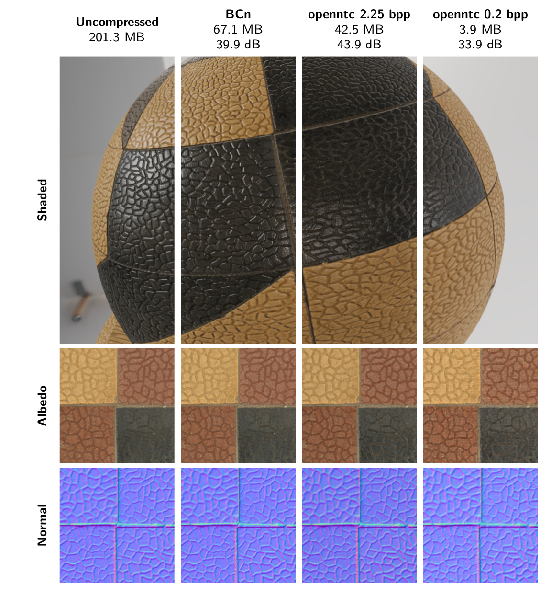
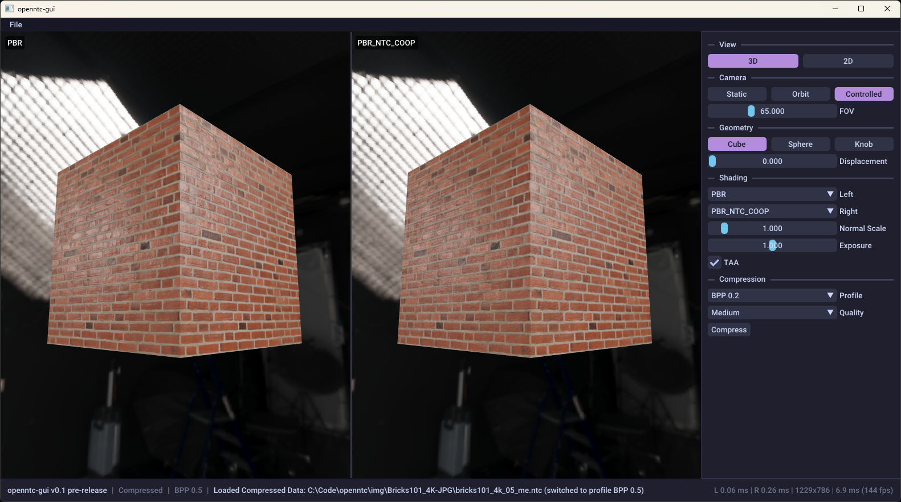
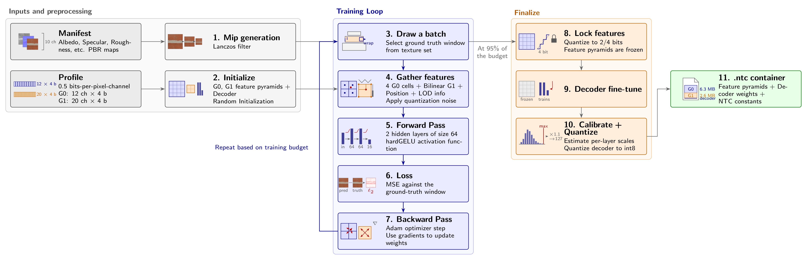

# openntc



openntc is a collection of source-available Neural Texture Compression tools written in C++20, CUDA and DirectX 12. It allows you to compress entire texture sets for PBR materials by 95%+ and delivers higher quality than traditional Block Compression (BCn) at smaller sizes. This project contains independant implementations of GPU-accelerated compression CUDA kernels, decompression HLSL headers and both GUI and C++ library interfaces to use it with.



An in-depth article on how it works is available here.



# Quickstart

Here's a quick guide to testing out our implementation of NTC tools on your own textures:

1) Grab a copy of the latest release [here](https://github.com/somnathsarkar/openntc/releases). Currently, we support Windows/CUDA machines for compression, and DirectX 12 for the runtime (decoding).
2) Create a description of your material using a JSON manifest. The format generally matches those of other NTC tools:
```json
{
  "width": 4096,
  "height": 4096,
  "textures": [
    {
      "fileName": "BaseColor.png",
      "isSRGB": true,
      "semantics": { "Albedo": "RGB" }
    },
    {
      "fileName": "Normal.png",
      "semantics": { "Normal": "RGB" }
    },
    {
      "fileName": "RoughnessMetalness.png",
      "semantics": { "Roughness": "G", "Metallic": "B" }
    },
    {
      "fileName": "AmbientOcclusion.png",
      "semantics": { "Occlusion": "R" }
    }
  ]
}
```
3) Select a profile in the GUI. Each profile has a different compression scheme, each with different bytes-per-pixel channel and quality values. Here are example results on a 9-channel, 4096 x 4096 PBR texture set at openntc's Ultra preset. Note that the uncompressed size of this texture set is 201.3 MB.

   | | openntc 0.2 bpp | openntc 0.5 bpp | openntc 1.0 bpp | openntc 2.25 bpp |
   |---|---|---|---|---|
   | Size | 3.93 MB | 9.52 MB | 19.0 MB | 42.5 MB |
   | Quality (PSNR) | 33.91 dB | 36.66 dB | 40.25 dB | 43.87 dB |

4) Select a training quality and hit train, progress is viewable via the training bar.
5) Compare reconstruction quality with the original by choosing one of the NTC options in the view panels, then Save Compressed via Ctrl-S.
6) Alternatively, we can use the libopenntc API via C++ as follows:
```cpp
#include <libopenntc/libopenntc.h>
...
using namespace openntc;
Context ctx;
ContextInitInfo init = { .profile_ = Profile::Bpp_0_5 };
if (ctx.Init(init) == Result::Success)
{
  if (ctx.LoadManifest("manifest.json") == Result::Success)
  {
    TrainInfo train = { .quality_ = Quality::Medium, .grids_per_batch_ = 1 };
    ctx.BeginTraining(train);
    ctx.TrainUntilComplete();

    EvalResults eval = ctx.Eval();
    std::cout << "PSNR: " << eval.psnr_ << " dB";

    Dump("bricks.ntc", ctx.GetCompressedData());
  }
}
```
7) To sample openntc-compressed textures in your own engine or project, use the openntc-runtime library to load buffers from the .ntc file. Bind these buffers as HLSL descriptors to your shader:
```cpp
#include <libopenntc/openntc_runtime.h>
...
openntc::FileData file;
if (openntc::Load("bricks.ntc", file) != openntc::Result::Success)
  return;
const openntc::CompressedData& cd = file.Data();

// Upload data to GPU, CreateBufferWithData is a placeholder helper function
// SRV: Buffer<uint>, Format: DXGI_FORMAT_R32_UINT
ID3D12Resource* g0_buf  = CreateBufferWithData(cd.g0_[0], cd.g0_total_size_);
// SRV: Buffer<uint>, Format: DXGI_FORMAT_R32_UINT
ID3D12Resource* g1_buf  = CreateBufferWithData(cd.g1_[0], cd.g1_total_size_);
// SRV: ByteAddressBuffer, Format: DXGI_FORMAT_R32_TYPELESS
ID3D12Resource* dec_buf = CreateBufferWithData(cd.decoder_, cd.decoder_size_);

// Constant buffer with texture-related information
openntc::NTCConstants consts;
openntc::FillNTCConstants(cd, consts);
ID3D12Resource* ntc_cb = CreateBufferWithData(&consts, sizeof(consts));
```
8) Include the ntc_decode.hlsli HLSL header and call our helper functions to retrieve your sample!
```hlsl
#define BPP_0_5
#include "ntc_decode.hlsli"

ConstantBuffer<NTC> NTCCBV : register(b1);   // NTCConstants from FillNTCConstants
Buffer<uint> g0 : register(t0);              // Feature pyramid 0
Buffer<uint> g1 : register(t1);              // Feature pyramid 1
ByteAddressBuffer decoder : register(t2);    // Decoder MLP weights

...

openntc::MaterialParams mat = openntc::SampleMaterial(g0, g1, decoder, NTCCBV, uv, lod);

// Now use material params mat.albedo_, mat.roughness_, etc. to perform lighting.
```

# Build Instructions

`openntc` uses CMake for building, and currently supports Windows and NVIDIA GPUs for compression. Make sure you have the prerequisites downloaded and installed correctly before starting a build:

1. Download `openntc-assets-vxxx.zip` from the latest [release](https://github.com/somnathsarkar/openntc/releases), and unzip it to `openntc/data`.
2. Clone and build [DirectXTex](https://github.com/microsoft/directxtex), then set CMake params `OPENNTC_DIRECTXTEX_INCLUDE_DIR` and `OPENNTC_DIRECTXTEX_LIB_DIR` to the corresponding folders.
3. Clone [Dear ImGUI](https://github.com/ocornut/imgui) then set CMake param `OPENNTC_IMGUI_DIR` to the cloned folder.
4. Download the [DirectXShaderCompiler](https://github.com/microsoft/DirectXShaderCompiler/releases/tag/v1.9.2607) and set CMake parameter `OPENNTC_DXC` to your local `dxc.exe`.

This is enough to build with DP4A support exclusively. However, it is strongly recommended to build with Cooperative Vector support for best performance for GPUs supporting Shader Model 6.10 (NVIDIA RTX 20-series and beyond). As of August 2026, this depends on preview NVIDIA drivers and Agility SDK support. To enable Cooperative Vector support:

1. Set CMake parameter `OPENNTC_COOP` to ON.
2. Download DirectX Agility SDK 1.721.3 or greater. [Download Link](https://www.nuget.org/packages/Microsoft.Direct3D.D3D12/1.721.3-preview) Set CMake param `OPENNTC_AGILITY_DIR` to the `build/native` folder within.
3. Download the latest preview release of [DirectXShaderCompiler](https://github.com/microsoft/DirectXShaderCompiler/releases/tag/v1.10.2605.37). Set CMake params `OPENNTC_DXC_PREVIEW` to the executable and `OPENNTC_DXC_PREVIEW_INCLUDE` to the include directory `inc/hlsl`.
4. Download and install the Geforce preview driver 620.12 or later: [Download link](https://developer.nvidia.com/downloads/assets/secure/geforce-drivers/620.12_gameready_win11_win10-dch_64bit_international.exe)

# License Information

All included third party license information is in `ThirdPartyLicenses.txt`.